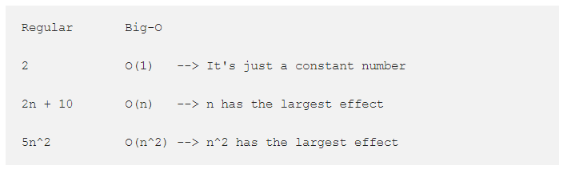
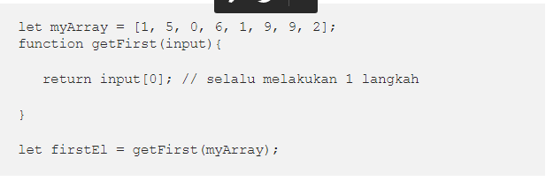
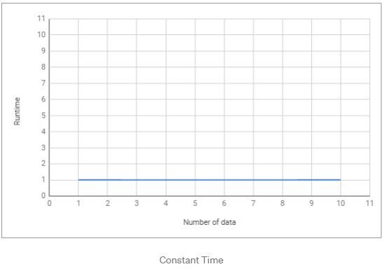
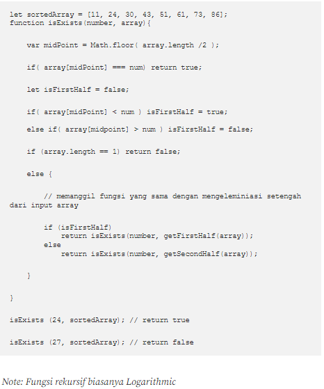
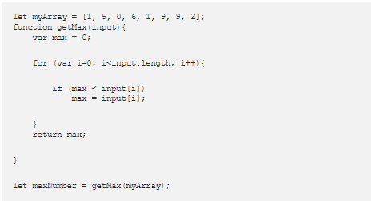
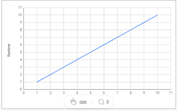
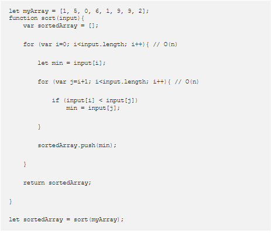
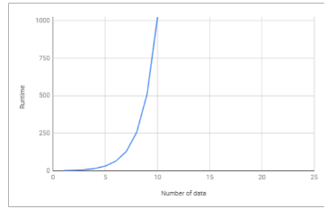
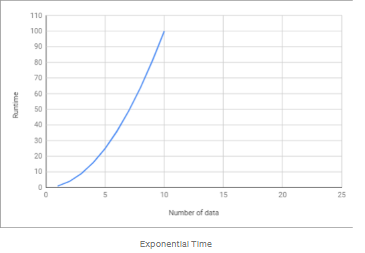

<h1 align="center"><b>Penjelasan Sederhana Tentang Time Complexity dan Big-O Notation
</b> </h1>

---

Kompleksitas suatu algoritma dibagi menjadi 2, yaitu Time Complexity dan Space Complexity.  Time Complexity adalah seberapa lama waktu yang diperlukan untuk menjalankan suatu algoritma. Sedangkan Space Complexity adalah seberapa besar memori yang kita gunakan untuk menjalankan suatu algoritma. Dan disini kita hanya akan membahas tentang Time Complexity.

---

#
## __ALGORTMA__

Sederhananya, algoritma adalah serangkaian proses yang dilakukan secara berurutan untuk menyelesaikan sebuah permasalahan. Algoritma bisa bermacam-macam tergantung kepada siapa yang membuat algoritma tersebut. Namun permasalahannya adalah algoritma mana yang lebih efektif dan efisien?  Time Complexity Analysis adalah suatu cara sederhana untuk mengetahui berapa lama waktu yang dibutuhkan untuk menjalankan suatu algoritma dengan input tertentu (n). Biasanya lebih dikenal dengan sebutan Big-O Notation.  <i>Big O Notation digunakan untuk mengukur tingkat kompleksitas suatu algoritma.</i>  Big-O Notation adalah cara untuk mengkonversi keseluruhan langkah-langkah suatu algoritma kedalam bentuk Aljabar, yaitu dengan menghiraukan konstanta yang lebih kecil dan koefisien yang tidak berdampak besar terhadap keseluruhan kompleksitas permasalahan yang diselesaikan oleh algoritma tersebut.  Mari kita liat contoh dibawah ini: 

Sederhananya, semua contoh yang ada diatas mengatakan bahwa “kita hanya akan melihat faktor yang memiliki dampak paling besar terhadap nilai yang dihasilkan oleh algoritma tersebut”.  Terdapat beberapa macam time complexity, diantaranya:

### ___O(1) — Constant Time___

Constant Time artinya banyaknya input yang diberikan kepada sebuah algoritma, tidak akan mempengaruhi waktu proses (runtime) dari algoritma tersebut.

Kita bisa melihat bahwa berapapun jumlah array yang diberikan kepada fungsi tersebut, dia akan selalu melakukan 1 hal, yaitu mengambil elemen pertama. Itu artinya jumlah input yang diberikan tidak mempengaruhi waktu proses (runtime) dari algoritma tersebut.

#
### ___O(log n) — Logarithmic Time___

Logarithmic Time artinya ketika kita memberikan input sebesar n terhadap sebuah fungsi, jumlah tahapan yang dilakukan oleh fungsi tersebut berkurang berdasarkan suatu faktor. Salah satu contohnya adalah algoritma Binary Search. 

#
### __O(n) — Linear Time__

Linear Time adalah ketika runtime dari fungsi kita berbanding lurus dengan jumlah input yang diberikan. 

Kita bisa melihat bahwa semakin banyak jumlah input yang diberikan, maka waktu proses/runtime dari fungsi tersebut akan semakin besar. 

#
### ___O(n²) — Quadratic Time___

Quadratic Time adalah ketika runtime dari fungsi kita adalah sebesar n^2, dimana n adalah jumlah input dari fungsi tersebut. Hal tersebut bisa terjadi karena kita menjalankan fungsi linear didalam fungsi linear (n*n). 

 

#
### ___O(2^n) — Exponential Time___

Exponential Time biasanya digunakan dalam situasi dimana kita tidak terlalu tahu terhadap permasalahan yang dihadapi, sehingga mengharuskan kita mencoba setiap kombinasi dan permutasi dari semua kemungkinan. 

